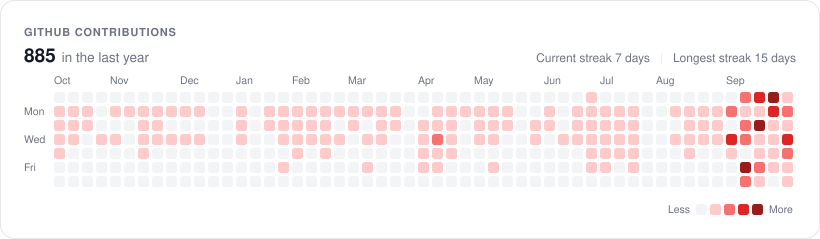
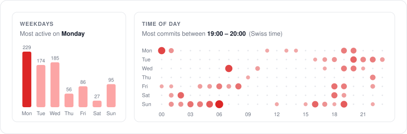
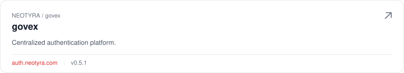
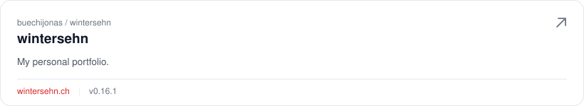
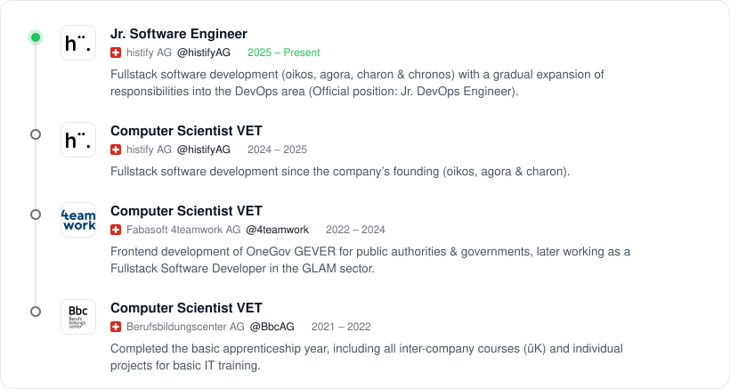
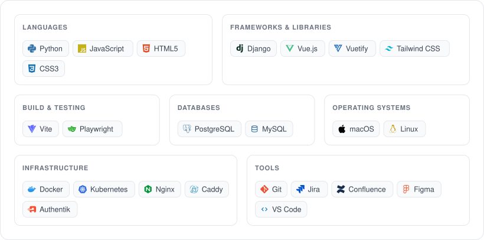

<picture><source media="(prefers-color-scheme: dark)" srcset="assets/header-dark.svg" /><source media="(prefers-color-scheme: light)" srcset="assets/header-light.svg" /></picture>

## GitHub Stats

<a href="https://github.com/buechijonas"><picture><source media="(prefers-color-scheme: dark)" srcset="assets/contributions-dark.svg" /><source media="(prefers-color-scheme: light)" srcset="assets/contributions-light.svg" /></picture></a>

<picture><source media="(prefers-color-scheme: dark)" srcset="assets/activity-dark.svg" /><source media="(prefers-color-scheme: light)" srcset="assets/activity-light.svg" /></picture>

## Projects

<a href="https://auth.neotyra.com"><picture><source media="(prefers-color-scheme: dark)" srcset="assets/card-govex-dark.svg" /><source media="(prefers-color-scheme: light)" srcset="assets/card-govex-light.svg" /></picture></a>

<a href="https://wintersehn.ch/"><picture><source media="(prefers-color-scheme: dark)" srcset="assets/card-wintersehn-dark.svg" /><source media="(prefers-color-scheme: light)" srcset="assets/card-wintersehn-light.svg" /></picture></a>

## Timeline

<picture><source media="(prefers-color-scheme: dark)" srcset="assets/timeline-dark.svg" /><source media="(prefers-color-scheme: light)" srcset="assets/timeline-light.svg" /></picture>

## Knowledge

<picture><source media="(prefers-color-scheme: dark)" srcset="assets/knowledge-dark.svg" /><source media="(prefers-color-scheme: light)" srcset="assets/knowledge-light.svg" /></picture>
